# Diagrama de Secuencia - Sistema de Procesamiento de Imágenes con ML

## Descripción del Sistema
Este diagrama muestra el flujo completo de la aplicación web de procesamiento de imágenes con MBLLEN (Multi-Branch Low-Light Enhancement Network), incluyendo autenticación, subida, procesamiento ML y gestión de archivos.

## Diagrama de Secuencia

```mermaid
sequenceDiagram
    participant U as Usuario
    participant F as Frontend<br/>React
    participant API as Express<br/>Server
    participant AUTH as Auth<br/>Middleware
    participant AC as Auth<br/>Controller
    participant IC as Image<br/>Controller
    participant DB as MySQL<br/>Database
    participant FS as File<br/>System
    participant ML as Python<br/>ML Script

    %% === FLUJO DE REGISTRO ===
    rect rgb(240, 248, 255)
        Note over U,DB: REGISTRO DE USUARIO
        U->>F: Accede a /register
        U->>F: Completa formulario
        F->>F: Valida con Formik + Yup
        F->>API: POST /api/auth/register
        API->>AC: register(req, res)
        AC->>AC: Hashea contraseña (bcrypt)
        AC->>DB: INSERT INTO Usuario
        DB->>AC: Retorna ID usuario
        AC->>AC: Genera JWT token
        AC->>API: Token + datos usuario
        API->>F: Respuesta exitosa
        F->>F: Guarda token en localStorage
        F->>F: Navega a /dashboard
    end

    %% === FLUJO DE LOGIN ===
    rect rgb(240, 255, 240)
        Note over U,DB: INICIO DE SESIÓN
        U->>F: Accede a /login
        U->>F: Ingresa credenciales
        F->>F: Valida formulario
        F->>API: POST /api/auth/login
        API->>AC: login(req, res)
        AC->>DB: SELECT usuario por correo
        DB->>AC: Datos del usuario
        AC->>AC: Compara contraseña (bcrypt)
        AC->>DB: INSERT INTO SesionUsuario
        AC->>AC: Genera JWT token
        AC->>API: Token + datos usuario
        API->>F: Respuesta exitosa
        F->>F: Guarda token + navega
    end

    %% === FLUJO DE OBTENER IMÁGENES ===
    rect rgb(255, 248, 240)
        Note over U,DB: CONSULTA DE IMÁGENES
        U->>F: Accede a /my-images
        F->>API: GET /api/images + Bearer token
        API->>AUTH: authenticateToken()
        AUTH->>AUTH: Verifica JWT
        AUTH->>API: req.user = userData
        API->>IC: getImages(req, res)
        IC->>DB: SELECT imágenes del usuario
        DB->>IC: Lista de imágenes
        IC->>API: Imágenes con URLs
        API->>F: Respuesta con imágenes
        F->>F: Renderiza galería
    end

    %% === FLUJO DE SUBIDA DE IMAGEN ===
    rect rgb(255, 240, 248)
        Note over U,FS: SUBIDA DE IMAGEN
        U->>F: Selecciona/arrastra archivos
        F->>F: Valida archivos (tipo, tamaño)
        F->>API: POST /api/images/upload + FormData
        API->>AUTH: Verifica token
        AUTH->>API: Usuario autorizado
        API->>IC: uploadImage() + Multer
        IC->>FS: Guarda en uploads/{userId}/
        FS->>IC: Archivo guardado
        IC->>DB: INSERT INTO Imagen
        DB->>IC: ID de imagen creada
        IC->>API: Datos de imagen
        API->>F: Subida exitosa
        F->>F: Actualiza UI
    end

    %% === FLUJO DE PROCESAMIENTO ===
    rect rgb(248, 240, 255)
        Note over U,ML: PROCESAMIENTO DE IMAGEN
        U->>F: Click "Procesar Imagen"
        F->>API: POST /api/images/{id}/process
        API->>AUTH: Verifica token
        API->>IC: processImage(req, res)
        IC->>DB: SELECT imagen por ID
        DB->>IC: Datos de imagen
        IC->>FS: Verifica archivo original
        IC->>IC: Crea directorio processed/
        
        alt Procesamiento ML
            IC->>ML: spawn Python script
            ML->>ML: Intenta cargar MBLLEN
            ML->>FS: Lee imagen original
            ML->>ML: Procesa con TensorFlow
            ML->>FS: Guarda imagen mejorada
            ML->>IC: Éxito ML
        else Fallback Básico
            IC->>ML: spawn Python script
            ML->>ML: Usa OpenCV + CLAHE
            ML->>FS: Lee imagen original
            ML->>ML: Aplica mejoras básicas
            ML->>FS: Guarda imagen mejorada
            ML->>IC: Éxito básico
        end
        
        IC->>DB: UPDATE procesada=TRUE
        IC->>API: URL imagen procesada
        API->>F: Procesamiento exitoso
        F->>F: Actualiza UI con comparación
    end

    %% === FLUJO DE VISUALIZACIÓN ===
    rect rgb(240, 255, 255)
        Note over U,FS: VISUALIZACIÓN Y COMPARACIÓN
        U->>F: Click en imagen
        F->>F: Abre modal comparación
        F->>API: GET imagen original (estática)
        API->>FS: Sirve archivo original
        FS->>API: Datos imagen
        API->>F: Imagen original
        
        alt Si hay imagen procesada
            F->>API: GET imagen procesada
            API->>FS: Sirve archivo procesado
            FS->>API: Datos imagen procesada
            API->>F: Imagen procesada
            F->>F: Muestra lado a lado
        end
    end

    %% === FLUJO DE DESCARGA ===
    rect rgb(255, 255, 240)
        Note over U,FS: DESCARGA DE IMAGEN
        U->>F: Click botón descargar
        F->>API: GET /api/images/{id}/download
        API->>AUTH: Verifica token
        API->>IC: downloadProcessedImage()
        IC->>DB: SELECT ruta_archivo_procesada
        DB->>IC: Ruta del archivo
        IC->>FS: Lee archivo procesado
        FS->>IC: Datos del archivo
        IC->>API: Envía como descarga
        API->>F: Archivo descargado
        F->>F: Navegador inicia descarga
    end

    %% === FLUJO DE ELIMINACIÓN ===
    rect rgb(255, 240, 240)
        Note over U,FS: ELIMINACIÓN DE IMAGEN
        U->>F: Click eliminar + confirma
        F->>API: DELETE /api/images/{id}
        API->>AUTH: Verifica token
        API->>IC: deleteImage(req, res)
        IC->>DB: SELECT rutas de archivos
        DB->>IC: Rutas original y procesada
        IC->>DB: DELETE FROM Imagen
        IC->>FS: Elimina archivo original
        IC->>FS: Elimina archivo procesado
        IC->>API: Eliminación completa
        API->>F: Confirmación
        F->>F: Actualiza UI
    end

    %% === MANEJO DE ERRORES ===
    rect rgb(255, 240, 240)
        Note over F,API: MANEJO DE ERRORES
        alt Error 401 (No autorizado)
            API->>F: Error 401
            F->>F: Elimina token localStorage
            F->>F: Redirige a /login
        else Error 5xx (Servidor)
            API->>F: Error servidor
            F->>F: Muestra mensaje error
        else Error 400 (Validación)
            API->>F: Error validación
            F->>F: Muestra errores formulario
        end
    end
```

## Componentes del Sistema

### Frontend (React)
- **Páginas**: Login, Register, Dashboard, MyImages, Profile
- **Componentes**: Material-UI, Framer Motion
- **Validación**: Formik + Yup
- **Estado**: LocalStorage para token
- **Comunicación**: Axios con interceptors

### Backend (Node.js/Express)
- **Rutas**: Auth, Images, Users, Health, Admin
- **Middleware**: CORS, Auth JWT, Multer
- **Controladores**: Auth, Image, User, Admin
- **Base de datos**: MySQL con pool de conexiones

### Base de Datos (MySQL)
- **Tablas**: Usuario, Imagen, SesionUsuario
- **Campos clave**: 
  - Usuario: id_usuario, nombre, correo, contraseña, rol
  - Imagen: id_imagen, nombre_archivo, ruta_archivo, procesada, ruta_archivo_procesada

### Machine Learning (Python)
- **Modelo principal**: MBLLEN (Multi-Branch Low-Light Enhancement)
- **Fallback**: OpenCV + CLAHE
- **Bibliotecas**: TensorFlow, OpenCV, NumPy, Pillow
- **Comunicación**: Child process spawn desde Node.js

### File System
- **Estructura**: uploads/{userId}/{archivo} y uploads/{userId}/processed/{archivo}
- **Formatos**: JPG, PNG, GIF (max 5MB)
- **Servidor estático**: Express static middleware

## Flujos de Datos Principales

1. **Autenticación**: Formulario → Validación → BD → JWT → LocalStorage
2. **Subida**: Drag&Drop → Multer → File System → BD → UI Update
3. **Procesamiento**: Click → Python ML → File System → BD Update → UI Refresh
4. **Visualización**: Modal → Archivos estáticos → Comparación lado a lado
5. **Gestión**: Descarga/Eliminación → BD + File System → UI Update

## Seguridad

- JWT tokens con expiración (24h)
- Middleware de autenticación en todas las rutas protegidas
- Validación de archivos (tipo, tamaño)
- Hash de contraseñas con bcrypt
- CORS configurado para frontend específico
- Manejo de errores con logs detallados

## Características Técnicas

- **Procesamiento híbrido**: ML avanzado con fallback robusto
- **UI responsiva**: Material-UI con tema oscuro
- **Drag & Drop**: Subida intuitiva de archivos
- **Comparación visual**: Lado a lado original vs procesada
- **Estados de carga**: Feedback visual durante operaciones
- **Manejo de errores**: Interceptors con auto-logout en 401 